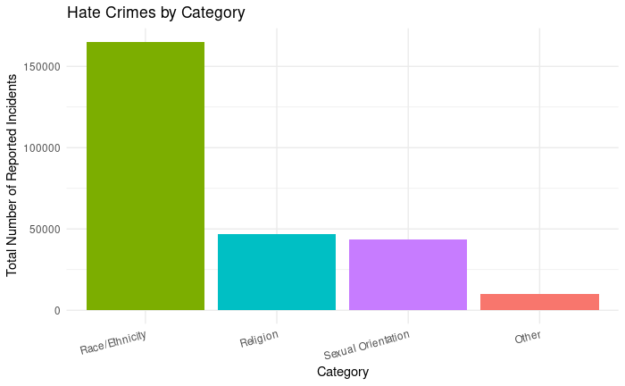
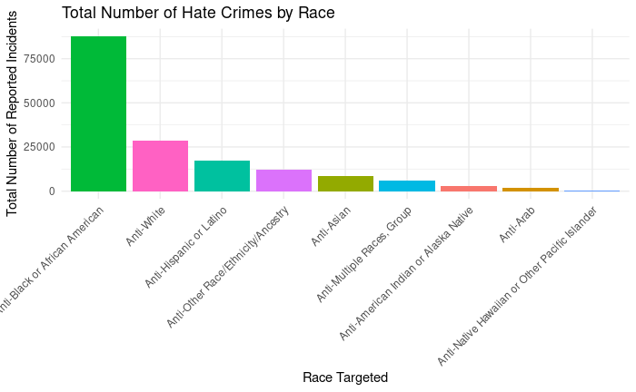
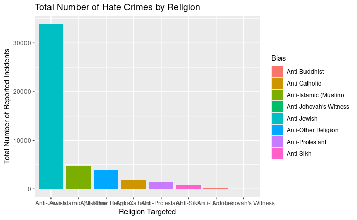
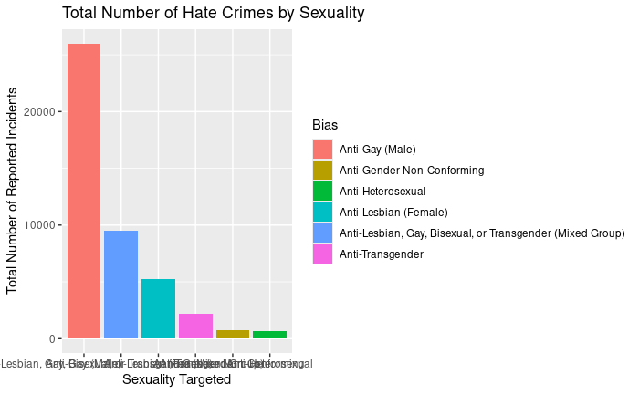
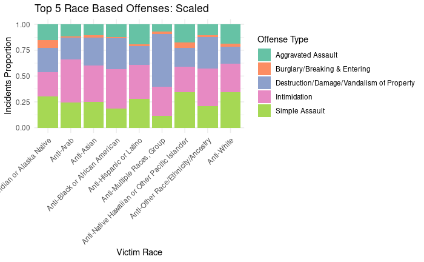

```{r setup, include=FALSE}
knitr::opts_chunk$set(echo = FALSE)
```

## Abstract
In this report, we looked at the United States hate crime data from the Federal Bureau of Investigation (FBI) data set to analyze the following question: *"Which groups (racial, religious, gender, etc...) are most frequently targeted, and what events may have caused the increase or decrease of certain types of hate crime over the years?"*. Using data visualizations such as bar graphs and statistical summaries (such as tables), we can identify hate crime trends and draw comparisons by bias, offender's race, and other carefully chosen variables. Our hope is to provide valuable insights that will lead us closer to discovering how bias-related crimes have evolved over time, discover what may trigger these crimes, and see who may be most susceptible to be victim of such hate crimes. We hope to find how data and statistical analysis can be used to make social justice discoveries.

---

## Introduction
The goal of this analysis is to investigate patterns in hate crimes across the United States. To answer our overarching research question, we developed specific prompts to guide our analysis and the visualizations we will create. These 6 prompts are also written out and further explored in our Plots.Rmd file.

1. Count the number of offenses per bias to see which group is most frequently targeted
2. Compare the number of offenses by race to identify which groups are more likely to be the victim to what offenses.
3. Analyze how the number of offenses has changed over time. 
4. Examine variation by state of offense types
5. See how many of each type of offense there is and compare quantities
6. Find correlations between biases and offense (eg. do Asians experience  intimidation based hate crimes or assault based hate crimes)

This analysis may benefit policymakers, sociologists, and law enforcement agencies and even the FBI from which the data set itself was retrieved. It may benefit them by identifying demographic trends and creating strategies towards prevention. Also understanding which groups may be most at risk can even help larger organizations and employers to create resources for employees to easily report such incidents.

---

## Data
We used the `hate_crime.csv` dataset. The raw data from the FBI data set (retrieved directly from their website) contains data over the span of 33 years (1994 to 2024) with 265,834 individual hate crime cases with 28 variables ranging from the dates of the incidents, the perpetrators race, the crime location and more. 

The Data Cleaning Process:
First, any rows with missing values were removed. Next, all character-type columns were converted to factors for statistical analysis and visualization of categorical data such as race, offense type, and bias. Finally, several columns were renamed for readability. These steps ensured that the dataset was clean, consistent, and ready for analysis.

After cleaning we decided to focus on the variables:
- Race of Offender: race of the offender  
- Year: year of the offense  
- State: where the offense took place  
- Bias: the group targeted by the hate crime  
- Offense: type of crime (e.g., intimidation, assault)  
- Victim Count: number of victims per case  

---

## Visualizations an Analysis

### Here is a review of the question that this project aims to answer: 

#### "Which groups (racial, religious, gender, etc...) are most frequently targeted, and what events may have caused the increase or decrease of certain types of hate crime over the years?"


The first thing that is very important to know is which group of people are the most common victims of hate crime.
The first thing was to separate the total data into groups based on groups of bias. The main groups are

- Race/Ethnicity
- Religion
- Sexual Orientation
- Other.

Other is anything that falls into gender, or multiple broad categories.

After separating them, we are left with this bar graph.

```{r, } 
 
```
This bar graph shows that a majority of hate crime that is conducted is targeting race, compared to the other categories. This may make a lot of sense, as Race/Ethnicity is among the first thing that someone sees when looking at a person, whereas for the other categories, it may not be as obvious.

---

Looking into the Race/Ethnicity category, we also seek to find the group of people within this group is targeted the most. After filtering out the race-based hate crimes from the total, and further categorizing them based on the race/ethnicity of the victim, we have this plot:

```{r} 
 
```

This plot shows that of the categories, Black or African American individuals were most targeted. One thing that seems to be interesting is how there is an "Anti-Other Race/Ethnicity/Ancestry", but doesn't specify what it can be. 

In a way, it is interesting that Black or African Americans have the most victims of hate crime, almost disproportionately compared to the other ethnicities. 

---

Looking at the next category, Religion, this is what the graph looks like when the religions are separated, to see which religion is the most attacked in hate crimes. 

```{r} 
 
```
Here, it seems that an overwhelming amount of attacks are towards Jewish individuals. However, one thing to point out is that someone who is Jewish could also pertain to someone's ethnicity. So the reality might be that Jews may be better suited in the Race/Ethnicity category. However, for the purposes of this current plot, it will be counted as a religion.

---

Next is Sexual Orientation, which can be seen here:

```{r} 
 
```

It seems that from the data, the most targeted group are against Gay (male), followed by a mixed group that may contain Lesbians, Gay, Bisexual, or Transgender individuals. This may be interesting, as it might indicate that there are more instances of hate crime are done towards groups of victims rather than a single victim, at least when not pertaining to "Gay (Male)" 

---

Going back to Race/Ethnicity, we were able to further separate each group by the proportion of different kinds of hate crimes. Of the many types of hate crimes that could be committed, the top 5 are: Intimidation, Destruction/Damage/Vandalism of Property, Simple Assault, Aggravated Assault, and Burglary/Breaking & Entering.

This was further placed in a bar graph to show the distribution of these crimes.

```{r} 
 
```

Looking at this graph, it can be seen that the group called "Anti-Multiple Races, Group" experiences more destruction or vandalism of property by proportion. It can also be seen that some proportions of type of crime are similar, such as "Intimidation," while other crimes like "Simple Assault" have some proportions that are a lot higher than other proportion between each race/ethnicity.

###  More to come

---

## Takeaway

TBD

---

### Contributions Section

Faith Ang:
- Created the GitHub repository and the R and Rmd blank files for the project
- Wrote a substantial amount of the README.md file
- Made ggplot templates for various plots in 02_funct_Plots.R, and functions for data cleaning
- Worked on 11_DataCleaning.Rmd and 12_Plots.Rmd (question 1).
- Worked on the Visualization and Analysis portion of FinalReport.Rmd

Ria Mathew:
- Edited: README.md, 01_funct_DataCleaning.R, 02_funct_Plots.R. (grammar, spelling, and smoother transitions)
- Worked on 11_DataCleaning.Rmd (revised and improved) and 12_Plots.Rmd (question 2).
- Worked on Abstract, introduction, and data of FinalReport.Rmd.

Xuanwei Ding:
- Worked substantially on 12_Plots.Rmd, coding for questions 3, 4, 5, and 6 on 12_Plots.Rmd.