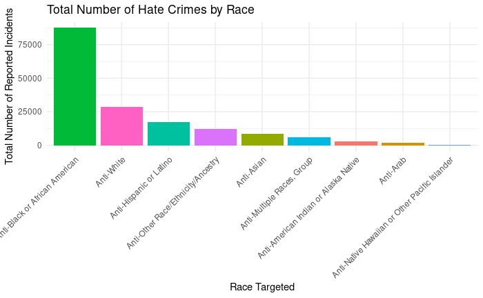
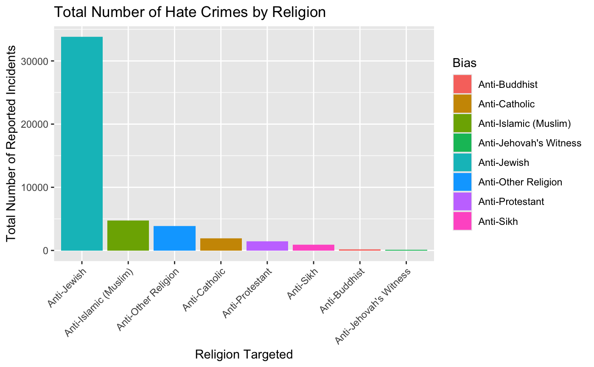
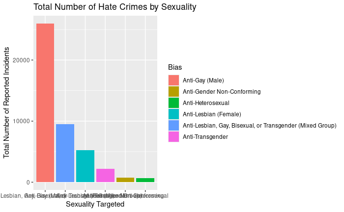

```{r setup, include=FALSE}
knitr::opts_chunk$set(echo = FALSE)
```

##"Which groups (racial, religious, gender, etc...) are most frequently targeted, and what events may have caused the increase or decrease of certain types of hate crime over the years?"

## Abstract
The purpose of this research and statistical analysis is to begin identifying significant trends in hate crime incidents across the United States, focusing on bias motivation, incident year, location and offense type. Using cleaned, standardized hate crime data, we analyze how these incidents have changed over time and which categories of hate crimes are most prevalent and where these cases appear the most frequently. Our data indicates that certain biases are more targeted (racial), and even within each bias (race/ethnicity, religion, sexual orientation, other) subgroups are also more targetted than others for instance Anti-Gay sentiment within the sexual orientation bias. Although the number of hate crimes fluctuates over time, there are several categories with clear trends that may reflect coexisting social and political dynamics going on at the same time.

Using data visualizations such as bar graphs and statistical summaries (such as tables), we can identify hate crime trends and draw comparisons by bias, offender's race, and other variables. Our hope is to provide valuable insights that will lead us closer to discovering how bias-related crimes have evolved over time, discover what may trigger these crimes, and see who may be most susceptible to be victim of such hate crimes. We hope to find how data and statistical analysis can be used to make social justice discoveries.

---

## Introduction
The purpose of this analysis is to investigate patterns in hate crimes across the United States. To answer our overarching research question, we developed specific prompts to guide our analysis and the visualizations we will create. These 6 prompts are also written out and further explored in our Plots.Rmd file.

1. Count the number of offenses per bias to see which group is most frequently targeted
2. Compare the number of offenses by race to identify which groups are more likely to be the victim to what offenses.
3. Analyze how the number of offenses has changed over time. 
4. Examine variation by state of offense types
5. See how many of each type of offense there is and compare quantities
6. Find correlations between biases and offense (eg. do Asians experience  intimidation based hate crimes or assault based hate crimes)

The results of this analysis may benefit policymakers, sociologists, and law enforcement agencies and even the FBI from which the data set itself was retrieved. It may benefit them by identifying demographic trends and creating strategies towards prevention. Also understanding which groups may be most at risk can even help larger organizations and employers to create resources for employees to easily report such incidents.

---

## Data
The data we used was the `hate_crime.csv` dataset. The raw data was an FBI dataset (retrieved directly from their website) which contains data over the span of 33 years (1994 to 2024) with 265,834 individual hate crime cases with 28 variables ranging from the dates of the incidents, the perpetrators race, the crime location and more. For this study we focused on the data that summarized hate crime cases by year and bias category, disregarding agency information and age-related data.

## Data Cleaning
The data cleaning process had a couple steps that helped ensure the data was consistent, generalization, relevant, and filled. First, any rows with missing values were removed. Next, all character-type columns were converted to factors for statistical analysis and visualization of categorical data such as the variables race, offense type, and bias. Finally, several columns were renamed for readability. These steps ensured that the dataset was clean, consistent, and ready for analysis.

After cleaning we decided to focus on the variables:
- Race of Offender: race of the offender  
- Year: year of the offense  
- State: where the offense took place  
- Bias: the group targeted by the hate crime  
- Offense: type of crime (e.g., intimidation, assault)  
- Victim Count: number of victims per case  

---

## Visualizations and Analysis

```{r, } 
knitr::include_graphics("hate_crime_category.png") 
```
To begin our analysis, it was very important that we knew which group was the most frequentlu the victim of hate crime.
We did this by categorizing the Bias data into 4 primary categories:  Race/Ethnicity, Religion, Sexual Orientation, Other. Other  consisted of biases that did not fall into these prominant categories yet did not have consistent data to create a category of its own, such as gender-affiliated ones. Once separating based on bias, we can see the incident count for racially motivated hate crime is almost 3.5 times as often as religion and sexual orientation which have roughly the same amount of reported incidences.

From this we can conclude that a majority of hate crime targets race. This is not unexpected, as Race/Ethnicity are often more immediately visible attributes, whereas other identity characteristics such as religion and sexual orientation may not be as obvious.

```{r} 
 
```

Breaking down the Race/Ethnicity Bias even further, we are aiming to find which group of people within our Race/Ethnicity Bias is targeted most. We do this by filtering out all non-race-based hate crimes leaving only a subset with bias motivations that are soley race-based. When we separate all the race-based incidents further and categorize them based on specific race of the victim (latino, arab), we have this plot of which Anti-'race' sentiment may have influenced the hate crime.

This plot shows that all the categories, displayed clearly in the graph, Black or African American individuals were most targeted. We notived there is a subsection also called "Anti-Other Race/Ethnicity/Ancestry", which doesn't specify what race it may include can be. It is possible that this category represents individuals who are multiracial, racially ambiguous, or whose identity did not fit these predefined classifications.

It is important to note that there may be Anti-Black or African American sentiment since this demographic represents the largest share of hate crime victims. Approximating 88,000 reported incidents disproportionate to other racial and ethnic groups which range from a few thousand to just over 25,000.

```{r} 
knitr::include_graphics("top5_offenses.png") 
```
Looking further into Race/Ethnicity, we were able to further separate each group by the proportion of different kinds of hate crimes. Of the many types of hate crimes that could be committed, the top 5 are: Intimidation, Destruction/Damage/Vandalism of Property, Simple Assault, Aggravated Assault, and Burglary/Breaking & Entering.

This was further placed in a bar graph to show the distribution of these crimes.

Looking at this graph, it can be seen that the group called "Anti-Multiple Races, Group" experiences more destruction or vandalism of property by proportion. It can also be seen that some proportions of type of crime are similar, such as "Intimidation," while other crimes like "Simple Assault" have some proportions that are a lot higher than other proportion between each race/ethnicity.


```{r} 
 
```
Doing the same process with the broad bias of religion, we see which religion is most attacked in hate crimes. Even more jarring than the disproportion we saw in race, it seems that an overwhelming amount of attacks are towards Jewish individuals. It may also be important to note that the identity 'Jewish' could also pertain to someone's ethnicity so this may increase the number of reports for this category. 

```{r} 
 
```

From the sexual orientation data visualization, we see the most affected group is Gay (male) individuals, followed by a broad category that contains Lesbians, Gay, Bisexual, or Transgender individuals, what is clarified as a mixed group. 


This may be interesting, as it might indicate that there are more instances of hate crime are done towards groups of victims rather than a single victim, at least when not pertaining to "Gay (Male)" - uhhh IM NOT SURE ABT THIS

###  More to come

---

## Takeaway

TBD

---

### Contributions Section

Faith Ang:
- Created the GitHub repository and the R and Rmd blank files for the project
- Wrote a substantial amount of the README.md file
- Made ggplot templates for various plots in 02_funct_Plots.R, and functions for data cleaning
- Worked on 11_DataCleaning.Rmd and 12_Plots.Rmd (question 1).
- Worked on the Visualization and Analysis portion of FinalReport.Rmd

Ria Mathew:
- Edited: README.md, 01_funct_DataCleaning.R, 02_funct_Plots.R. (grammar, spelling, and smoother transitions)
- Worked on 11_DataCleaning.Rmd (revised and improved) and 12_Plots.Rmd (question 2).
- Worked on Abstract, introduction, and data of FinalReport.Rmd.

Xuanwei Ding:
- Worked substantially on 12_Plots.Rmd, coding for questions 3, 4, 5, and 6 on 12_Plots.Rmd.