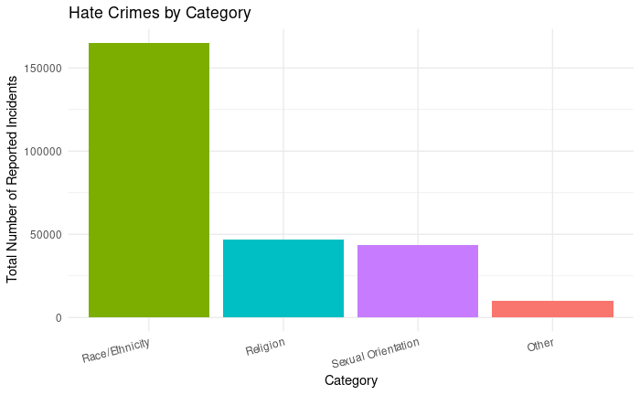
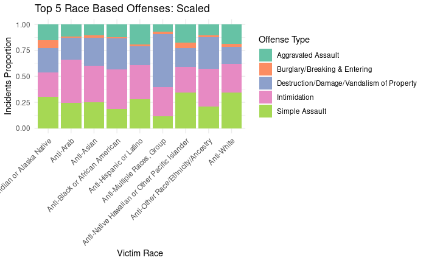
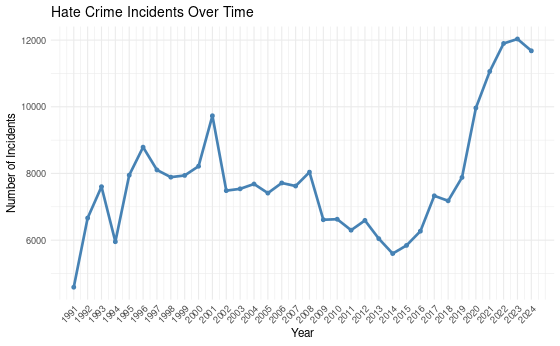
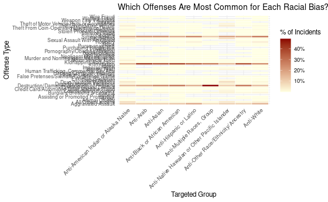

```{r setup, include=FALSE}
knitr::opts_chunk$set(echo = FALSE)
```

##"Which groups (racial, religious, gender, etc...) are most frequently targeted, and what events may have caused the increase or decrease of certain types of hate crime over the years?"

## Abstract
The purpose of this research and statistical analysis is to begin identifying significant trends in hate crime incidents across the United States, focusing on bias motivation, incident year, location and offense type. Using cleaned, standardized hate crime data, we analyze how these incidents have changed over time and which categories of hate crimes are most prevalent and where these cases appear the most frequently. Our data indicates that certain biases are more targeted (racial), and even within each bias (race/ethnicity, religion, sexual orientation, other) subgroups are also more targetted than others for instance Anti-Gay sentiment within the sexual orientation bias. Although the number of hate crimes fluctuates over time, there are several categories with clear trends that may reflect coexisting social and political dynamics going on at the same time.

Using data visualizations such as bar graphs and statistical summaries (such as tables), we can identify hate crime trends and draw comparisons by bias, offender's race, and other variables. Our hope is to provide valuable insights that will lead us closer to discovering how bias-related crimes have evolved over time, discover what may trigger these crimes, and see who may be most susceptible to be victim of such hate crimes. We hope to find how data and statistical analysis can be used to make social justice discoveries.

## Introduction
The purpose of this analysis is to investigate patterns in hate crimes across the United States. To answer our overarching research question, we developed specific prompts to guide our analysis and the visualizations we will create. These 6 prompts are also written out and further explored in our Plots.Rmd file.

1. Count the number of offenses per bias to see which group is most frequently targeted
2. Compare the number of offenses by race to identify which groups are more likely to be the victim to what offenses.
3. Analyze how the number of offenses has changed over time. 
4. Examine variation by state of offense types
5. See how many of each type of offense there is and compare quantities
6. Find correlations between biases and offense (eg. do Asians experience  intimidation based hate crimes or assault based hate crimes)

The results of this analysis may benefit policymakers, sociologists, and law enforcement agencies and even the FBI from which the data set itself was retrieved. It may benefit them by identifying demographic trends and creating strategies towards prevention. Also understanding which groups may be most at risk can even help larger organizations and employers to create resources for employees to easily report such incidents.

## Data
The data we used was the `hate_crime.csv` dataset. The raw data was an FBI dataset (retrieved directly from their website) which contains data over the span of 33 years (1994 to 2024) with 265,834 individual hate crime cases with 28 variables ranging from the dates of the incidents, the perpetrators race, the crime location and more. For this study we focused on the data that summarized hate crime cases by year and bias category, disregarding agency information and age-related data.

## Data Cleaning
The data cleaning process had a couple steps that helped ensure the data was consistent, generalization, relevant, and filled. First, any rows with missing values were removed. Next, all character-type columns were converted to factors for statistical analysis and visualization of categorical data such as the variables race, offense type, and bias. Finally, several columns were renamed for readability. These steps ensured that the dataset was clean, consistent, and ready for analysis.

After cleaning we decided to focus on the variables:
- Race of Offender: race of the offender  
- Year: year of the offense  
- State: where the offense took place  
- Bias: the group targeted by the hate crime  
- Offense: type of crime (e.g., intimidation, assault)  
- Victim Count: number of victims per case  

## Visualizations and Analysis

```{r, } 
 
```
To begin our analysis, it was very important that we knew which group was the most frequently the victim of hate crime.
We did this by categorizing the Bias data into 4 primary categories:  Race/Ethnicity, Religion, Sexual Orientation, Other. Other  consisted of biases that did not fall into these prominent categories yet did not have consistent data to create a category of its own, such as gender-affiliated ones. Once separating based on bias, we can see the incident count for racially motivated hate crime is almost 3.5 times as often as religion and sexual orientation which have roughly the same amount of reported incidences.

We conclude that a majority of hate crime targets race. This is not unexpected, as Race/Ethnicity are often more immediately visible attributes, whereas other identity characteristics such as religion and sexual orientation may not be as obvious.

```{r, out.width="33%", fig.show="hold"} 
knitr::include_graphics(
  c("race_crime.png", "religion_crimes.png", "sex_crime.png")
)
```

To better understand which groups are most targeted within each broad bias category, we filtered the dataset to include only incidents related to these 3 main groups: Race/Ethnicity, Religion, and Sexual Orientation. For each category, broke down the data even further by specific subBias groups (ex: Anti-Black, Anti-Jewish, Anti-Gay) and plotted the incident count for each subgroup. By breaking these down we aim to find which groups are most targeted.

As a side note, through the rest of this report we will be addressing more encompassing biases as 'main bias' groups (Race/Ethnicity, Religion, and Sexual Orientation) and the sub categories within these 3 aforementioned bias groups as 'sub bias' groups (ex: Anti-Black within Race/Ethnicity or Anti-Jewish within Religion).

Across the 3 bar graphs we see the pattern that one group has a large portion of the reported hate crimes, showing strong disproportions between each sub bias of our 3 main bias categories.

Race/Ethnicity Main Bias:
This plot shows highlights that there may be Anti-Black or African American sentiment since this demographic represents the largest share of hate crime victims. Approximating 88,000 reported incidents disproportionate to other racial and ethnic groups which range from a few thousand to just over 25,000.

Religion Main Bias:
Considering ratios, it seems an overwhelming amount of attacks are towards Jewish individuals. It may also be important to note that the identity 'Jewish' could also pertain to someone's ethnicity so this classification may contain an even wider range of incidents. 

Sexual Orientation Main Bias:
We see the most affected group is Gay (male) individuals, followed by a broad category that contains Lesbians, Gay, Bisexual, or Transgender individuals, what is clarified as a mixed group, less clearly defined since it broadly contains many subgroups. 

Each of our main bias categories has one sub-bias group that clearly stands out as the most targeted. For Race/Ethnicity it was Anti-Black or African American, for religion it was Anti-Jewish, for sexual orientation it was Gay (Male). Across all three plots, we see a concentrated pattern of hate crimes disproportionately affecting a single community within each category, highlighting substantial disparities between sub bias groups. While our earlier graph showed that Race/Ethnicity has a significantly higher overall number of incidents between our main bias groups, this more detailed breakdown reveals how hate crimes are similarly not evenly distributed within each main bias. The outlier subgroups that we see in each of our main biases we plotted displays an uneven distribution in levels of victimization.

```{r} 
 
```
Looking further into Race/Ethnicity, since it has the most number of reported incidents by category, we broke down each group by the proportion of different hate-crime types. To make sure that our comparisons were not skewed by differences in total incident counts between groups, we normalized the data by scaling it so each bar reflects proportion instead of raw incident count. Among all hate-crime categories, the five reoccurring ones we identified were Intimidation, Destruction/Damage/Vandalism of Property, Simple Assault, Aggravated Assault, and Burglary/Breaking & Entering.

With each of the different races having similar offense type breakdowns (similar proportions of each offense type), the normalized graph typically assists in highlighting differences. However, from the little variations we see, we may be able to conclude that offense types may not be specific to race as the differences are miniscule and may just be chance and due to smaller sample sizes in some of the races.

From this graph, the graph with the least similar proportions are that from “Anti-Multiple Races, Group” which we can't accurately say reflects differences in offense type based on race since it includes multiple races. 

```{r, out.width="50%", fig.show="hold"} 
#knitr::include_graphics(
  #c("Hate Crime Incidents Over Time png", "Bias Over the Year png")
#)
```
These visuals track hate crime incidents over the years with the second displaying the three most targeted sub bias groups from our previously data visuals. Each point represents a year and their size is corresponds with the number of reported incidents.

The first line plot shows the overall trend with no bias specific statistics showing upswings 2018 onwards and similarly more incidents between 1996 and 2001. It also shows a significant dip between 2008 and 2017. With our second bubble plot we can compare and see if this trend is reflected among the subgroups that most dominate our data set: our 3 prominent sub biases from each main category (Anti—Black or African American, Anti-Jewish, Anti-Gay.

Although it is a little difficult to tell since there are more incidents with our Race main Bias in comparison with our other bias categories, we can see that the bubble graph still reflects the same general trends. There there are larger bubbles across all three sub biases during the same years as those reflected in the line graph, and visa versa with the smaller bubbles. This is most visible with our Anti—Black or African American sub bias group, but that may just be more pronounced because there are more incidents while the other 2 sub bias groups sub are more subtle.

Based on the time charts, we can infer that overall hate-crime incidents are influenced by social or historical forces that affect all groups, not just one. For instance, the upswing from 2018 onwards may be due to the tensions with the political climate or increased media presence, or it may be as simple as better methods for reporting incidents where it seems as though hate crime is increasing when in reality it is changes in accessibility.

####EVERYTHING BEYOND THIS POINT NEEDS TO BE FIXED I have broad idea of how this next section can go and beyond that idk

```{r, out.width="33%", fig.show="hold"} 
# top 3 hate crime offenses by state graphs 3 
knitr::include_graphics(
  c("top_3_simple_assault.png", "top_3_intimidation.png", "top_3_vandal.png") 
)
```

```{r} 
 
```
start by talking about both graphs and how you are trying to conclude things about location and why taht is significant

line graph; talk about how you can visualize how the proportion of different crimes has evolved over the years for each geographical region. talk about how some are similar, why there might be less in one, are there less states, is the overall population of these lesser and is that why it reflects on the inceident numbers. talk about the trend going higher and lower in some areas and if that is different based on region. 

bar graphs; hate crime offenses by state - talk abt significance of looking into that. the y axis has the same order of states in each bar graph to draw comparisons easier. talk about that and how there are differences between states ex: lots of intimdation, very little assault in new jersey but in california pretty much high throughout, not much noticable fluctuation. what can you conclude from that. more. theres a lot you can conclude from this and talk abot significance of this.

```{r} 
 
```

---

## Takeaway

TBD

---

### Contributions Section

Faith Ang:
- Created the GitHub repository and the R and Rmd blank files for the project
- Wrote a substantial amount of the README.md file
- Made ggplot templates for various plots in 02_funct_Plots.R, and functions for data cleaning
- Worked on 11_DataCleaning.Rmd and 12_Plots.Rmd (question 1).
- Worked on the Visualization and Analysis portion of FinalReport.Rmd

Ria Mathew:
- Edited: README.md, 01_funct_DataCleaning.R, 02_funct_Plots.R. (grammar, spelling, and smoother transitions)
- Worked on 11_DataCleaning.Rmd (revised and improved) and 12_Plots.Rmd (question 2).
- Worked on Abstract, introduction, and data of FinalReport.Rmd.

Xuanwei Ding:
- Worked substantially on 12_Plots.Rmd, coding for questions 3, 4, 5, and 6 on 12_Plots.Rmd.